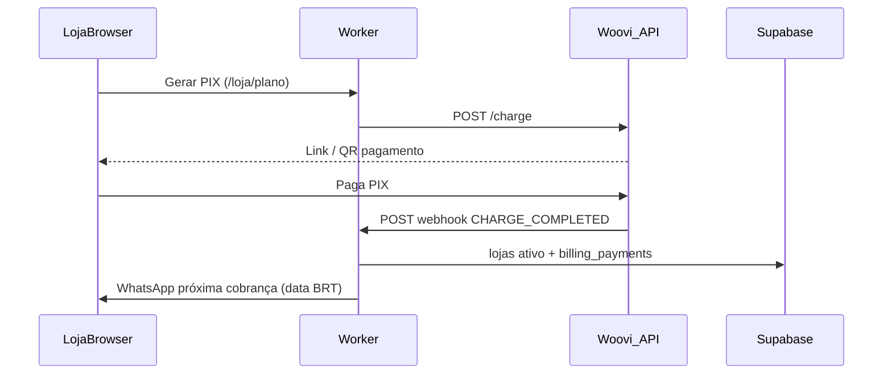

# Prompt: Implementar cobrança SaaS mensal com Woovi/OpenPix (PIX)

Documento para outro agente (ou desenvolvedor) replicar a integração completa de planos de pagamento com Woovi/OpenPix — frontend, backend e configuração no painel Woovi.

Baseado na implementação em produção do **IndicaAí**. Ver também [BILLING.md](./BILLING.md) para detalhes internos do projeto.

---

## Contexto

Implementar um **sistema de assinatura mensal via PIX** para um SaaS multi-tenant (cada cliente = uma "loja" ou "organização"). O gateway de pagamento é **Woovi** (marca comercial; API em `api.openpix.com.br` ou `api.woovi.com`).

**Modelo de negócio a implementar:**

| Item | Valor |
| --- | --- |
| Trial | **7 dias** grátis no cadastro |
| Plano | **R$ 39,90/mês** (3990 centavos) — valor configurável |
| Meio | PIX dinâmico (link + QR Code) |
| Renovação | **+30 dias** após cada pagamento confirmado (+ crédito de dias pagos antecipadamente) |
| Lembretes | WhatsApp **5, 3 e 1** dia(s) antes do vencimento (trial e renovação) |
| Inadimplência | Status `pendente`, **pausar funcionalidades** (ex.: campanhas) |
| Histórico | Pagamentos confirmados + download de **comprovante PDF** via API Woovi |
| Reembolso (opcional) | Integral até o 10º dia; depois pro-rata |
| Cron | Job diário para lembretes, pausa e geração automática de PIX no vencimento |

**Stack de referência (IndicaAí):** TanStack Start (server functions + rotas API), Supabase PostgreSQL, Cloudflare Workers + Cron Trigger. Adapte ao stack do projeto destino, mas **preserve a lógica de negócio e os contratos com a Woovi**.

---

## Parte 1 — Configuração no painel Woovi (OpenPix)

### 1.1 Criar conta e chave de API

1. Acesse **https://app.woovi.com** (produção) ou ambiente sandbox se disponível.
2. Menu lateral → **API/Plugins** → **Nova API/Plugin**.
3. Nome: ex. `"MeuApp Billing Backend"`.
4. Tipo: **API** (integração server-side; não use Plugin para backend).
5. Complete o **2FA** se solicitado.
6. Copie o **AppID** (ou **Client ID** + **Client Secret**).

**Regras críticas de autenticação:**

- Header: `Authorization: <AppID>` — **sem** prefixo `Bearer`, **sem** aspas
- Se tiver Client ID + Secret: AppID = `Base64(clientId:clientSecret)`
- **Não confundir** AppID da API com token do webhook — são credenciais diferentes
- Erro `appID inválido` (HTTP 401) → regenerar chave no painel

**Base URL da API:**

```
https://api.openpix.com.br/api/v1
```

(ou `https://api.woovi.com/api/v1` — verificar docs atuais)

### 1.2 Configurar webhook

1. Painel Woovi → **Webhooks** → **Novo webhook**
2. **URL:** `POST https://SEU-DOMINIO.com/api/webhooks/woovi`
3. **Authorization header:** defina um valor secreto longo (ex. UUID) — será `WOOVI_WEBHOOK_AUTHORIZATION` no servidor
4. **Eventos obrigatórios:**
   - `OPENPIX:CHARGE_COMPLETED` — cobrança paga (principal)
   - `PIX_TRANSACTION_REFUND_SENT_CONFIRMED` — reembolso confirmado (se suportar estornos)
5. Opcional: `OPENPIX:CHARGE_EXPIRED` — cobrança expirada
6. Salve. A Woovi envia um **teste** com `{ "evento": "teste_webhook" }` — a rota deve responder `{ ok: true }` com HTTP 200

**Importante sobre reembolso:**

- Eventos `PIX_TRANSACTION_REFUND_RECEIVED_*` são para quando **você recebe** reembolso de terceiros
- Para estornar cobranças **suas**, use `PIX_TRANSACTION_REFUND_SENT_CONFIRMED`
- Reembolso manual: painel Woovi → localizar transação PIX → estornar

### 1.3 Testar conectividade

```bash
curl -X GET 'https://api.openpix.com.br/api/v1/charge' \
  -H 'Authorization: SEU_APPID_AQUI' \
  -H 'Accept: application/json'
```

Deve retornar 200 (lista vazia ou cobranças), não 401.

---

## Parte 2 — Variáveis de ambiente

```env
# Opção A: AppID pronto (API/Plugins → copiar AppID; sem aspas, sem "Bearer")
WOOVI_APP_ID=

# Opção B: montar AppID a partir de Client ID + Client Secret
WOOVI_CLIENT_ID=Client_Id_...
WOOVI_CLIENT_SECRET=Client_Secret_...

# Webhook (header Authorization configurado no painel — DIFERENTE do AppID)
WOOVI_WEBHOOK_AUTHORIZATION=

# URL pública do app (links em notificações WhatsApp)
PUBLIC_APP_URL=https://seu-dominio.com

# Cron diário (protege GET /api/cron/billing)
BILLING_CRON_SECRET=

# Opcional: override da base URL
# WOOVI_API_URL=https://api.openpix.com.br/api/v1
```

**Nunca** exponha `WOOVI_APP_ID` no frontend.

---

## Parte 3 — Schema de banco de dados

### 3.1 Colunas na entidade cliente (`lojas` / `organizations`)

| Coluna | Tipo | Descrição |
| --- | --- | --- |
| `billing_status` | text | `trial` \| `ativo` \| `pendente` \| `inadimplente` |
| `trial_ends_at` | timestamptz | Fim do trial (created_at + 7 dias) |
| `next_billing_at` | timestamptz | Próximo vencimento |
| `billing_period_ends_at` | timestamptz | Fim do período pago atual |
| `last_payment_at` | timestamptz | Último pagamento confirmado |
| `woovi_charge_correlation_id` | text | ID da cobrança Woovi pendente |
| `woovi_payment_link_url` | text | Link de pagamento PIX ativo |

### 3.2 Tabela `billing_payments` (histórico)

| Coluna | Descrição |
| --- | --- |
| `loja_id` | FK cliente |
| `paid_at` | Data/hora pagamento |
| `value_cents` | Valor (3990) |
| `correlation_id` | ID da cobrança Woovi |
| `end_to_end_id` | PIX end-to-end (PDF) |
| `woovi_transaction_id` | ID transação Woovi |
| `woovi_event_key` | UNIQUE — idempotência webhook |
| `status` | `pago` \| `reembolsado` |
| `refunded_at`, `refund_value_cents`, `refund_woovi_event_key` | Metadados reembolso |
| `refund_type`, `days_used_at_refund`, `suggested_refund_cents` | Política de reembolso |

### 3.3 Tabelas auxiliares

- `billing_events` — log de webhooks com `event_key` UNIQUE (idempotência)
- `billing_reminder_log` — lembretes enviados (`loja_id` + `reminder_key` UNIQUE)
- `campanhas.pausado_por_billing` — boolean para reativar após pagamento

### 3.4 Inicialização no cadastro

Ao criar cliente:

```typescript
{
  billing_status: "trial",
  trial_ends_at: createdAt + 7 dias,
  next_billing_at: createdAt + 7 dias,
}
```

Referência: `src/lib/billing/fields.ts` → `billingFieldsForNewLoja()`.

---

## Parte 4 — Backend: módulos e responsabilidades

Organize em `lib/billing/`:

### 4.1 `woovi/auth.server.ts`

- `normalizeWooviAppId()` — remove Bearer, aspas, whitespace
- `buildWooviAppIdFromClientCredentials()` — Base64(clientId:secret)
- `resolveWooviAuthorization()` — lê env e retorna AppID
- `getWooviApiBase()` — default `https://api.openpix.com.br/api/v1`

### 4.2 `woovi/client.server.ts`

- `wooviFetch<T>(path, init)` — fetch com Authorization, parse JSON, extrai erros
- `isWooviConfigured()` — boolean

### 4.3 `woovi/charge.server.ts` — Criar cobrança PIX

**Endpoint Woovi:** `POST /charge`

**Payload:**

```json
{
  "correlationID": "app-loja-{uuid}-{timestamp}",
  "value": 3990,
  "comment": "MeuApp - Plano mensal 39,90",
  "expiresIn": 259200,
  "customer": {
    "name": "Nome da Loja",
    "phone": "5571999999999"
  }
}
```

**Regras:**

- `correlationID` deve ser **único** e permitir extrair `lojaId`: regex `^app-loja-([uuid])-`
- `value` em **centavos**
- `expiresIn` em segundos (3 dias = 259200)
- `comment` **somente ASCII** — emojis quebram a API (sanitizar!)
- `customer.phone` com DDI 55 + 11 dígitos

**Resposta:** extrair `charge.paymentLinkUrl`, `charge.brCode`, `charge.correlationID`

**Funções:**

- `buildChargeCorrelationId(lojaId)`
- `parseLojaIdFromCorrelation(correlationID)`
- `createWooviPlanCharge({ lojaId, lojaNome, whatsapp11 })`

### 4.4 `woovi/webhook.server.ts` — Processar webhooks

**Rota:** `POST /api/webhooks/woovi`

**Fluxo:**

1. Validar header `Authorization` === `WOOVI_WEBHOOK_AUTHORIZATION`
2. Parse JSON body
3. Se `evento === "teste_webhook"` → `{ ok: true, test: true }`
4. Se `event === "OPENPIX:CHARGE_COMPLETED"` (ou `PIX_AUTOMATIC_COBR_COMPLETED`):
   - Extrair `charge.correlationID` → `lojaId`
   - `eventKey = "woovi:{event}:{correlationID}"`
   - Inserir em `billing_events` — se duplicate, ignorar (idempotência)
   - Chamar `aplicarPagamentoLoja(lojaId, paidAt, { eventKey, payload })`
5. Se `event === "PIX_TRANSACTION_REFUND_SENT_CONFIRMED"`:
   - Localizar pagamento por `originalTransaction.endToEndId`
   - Marcar `billing_payments.status = reembolsado`
   - Chamar `suspenderPlanoAposReembolso(lojaId)`

**Payload típico CHARGE_COMPLETED:**

```json
{
  "event": "OPENPIX:CHARGE_COMPLETED",
  "charge": {
    "correlationID": "app-loja-uuid-timestamp",
    "status": "COMPLETED",
    "paidAt": "2026-06-05T12:00:00.000Z",
    "value": 3990,
    "pix": { "endToEndId": "E12345..." }
  }
}
```

### 4.5 `billing.server.ts` — Lógica de negócio

**`aplicarPagamentoLoja(lojaId, paidAt, meta)`:**

1. Calcular próximo vencimento: `nextBillingAfterPayment(paidAt, dueAt)`
   - Fórmula: `paidAt + 30 dias + diasPagosAntesDoVencimento`
   - Ex.: vence 02/07, pagou 27/06 (5 dias antes) → 27/06 + 30 + 5 = 01/08
2. Update `lojas`: `billing_status=ativo`, `last_payment_at`, `next_billing_at`, `billing_period_ends_at`, limpar `woovi_*`
3. Inserir em `billing_payments` via `registrarPagamentoPlano`
4. Reativar campanhas com `pausado_por_billing=true`
5. Notificar cliente (WhatsApp/email) com data próxima cobrança em **America/Sao_Paulo**

**`ensureWooviChargeForLoja(loja)`:**

- Se já tem `woovi_payment_link_url` → retornar
- Senão → `createWooviPlanCharge`, salvar correlation + link no banco

**`runBillingDailyJob()` (cron):**

Para cada cliente:

1. Calcular estado UI (`getBillingUiState`)
2. Enviar lembrete WhatsApp se `daysUntilDue ∈ {5, 3, 1}` (com idempotência)
3. Se trial expirou ou vencimento passou → `billing_status=pendente`, pausar campanhas
4. Se vencido e Woovi configurado → `ensureWooviChargeForLoja` (gera PIX automaticamente)

### 4.6 `woovi/charge-lookup.server.ts`

- `fetchWooviChargeMeta(correlationID)` → `GET /charge/{correlationID}` para obter `endToEndId`
- `extractPaymentMetaFromWebhook(payload)` — normaliza campos do webhook
- `extractRefundMetaFromWebhook(payload)` — para reembolsos

### 4.7 `woovi/receipt.server.ts`

- `fetchWooviReceiptPdf(endToEndId)` → `GET /receipt/pix-in/{endToEndId}` com `Accept: application/pdf`

### 4.8 `woovi/sanitize-text.ts`

- `wooviChargeComment()` — ASCII only
- `wooviCustomerName(raw)` — remove emoji, max 120 chars

### 4.9 `woovi/errors.ts`

- `mensagemErroPixParaLoja(err)` — mensagens amigáveis sem citar Woovi

### 4.10 `dates.ts`

- **Sempre** usar fuso `America/Sao_Paulo` para exibição e contagem de dias
- `calendarDaysUntil(target, now)` — dias de calendário (0 = vence hoje)
- `nextBillingAfterPayment(paidAt, dueAt)`
- `formatDatePt(iso)` — dd/mm/yyyy BRT

### 4.11 `state.ts` — Estado para UI

**`getBillingUiState(loja, now)`** retorna:

```typescript
{
  phase: "trial" | "ativo" | "pendente",
  billingStatus,
  trialEndsAt,
  nextBillingAt,
  daysUntilDue,
  isPaidAndCurrent,      // ativo E periodEnd >= hoje
  needsPayment,          // !isPaidAndCurrent && vencido
  showTrialBanner,
  showPaymentBanner,
  showPixPaymentButton,  // visível se daysUntilDue <= 5 OU needsPayment
}
```

**Regra do botão PIX:** oculto se plano ativo e faltam **>5 dias** para vencimento.

---

## Parte 5 — API do servidor (server functions / REST)

| Endpoint/Function | Método | Input | Output |
| --- | --- | --- | --- |
| `gerarPixPlanoRemote` | POST | `{ lojaId }` | `{ paymentLinkUrl }` |
| `obterBillingStatusRemote` | POST | `{ lojaId }` | BillingUiState + planLabel + paymentLinkUrl |
| `listarPagamentosPlanoRemote` | POST | `{ lojaId, dateFrom?, dateTo? }` | BillingPaymentListItem[] |
| `baixarReciboPagamentoRemote` | POST | `{ lojaId, paymentId }` | `{ filename, base64 }` |
| `getPublicPlanSettingsRemote` | GET | — | `{ planLabel, planValueCents, trialDays }` |
| `GET /api/cron/billing?secret=...` | GET | secret | `{ ok, processed, errors }` |
| `POST /api/webhooks/woovi` | POST | body Woovi | `{ ok }` |

**Autenticação:** server functions devem validar sessão do cliente (só a própria loja gera PIX).

**Cron:** proteger com `BILLING_CRON_SECRET` via query param, header `x-cron-secret` ou Authorization Bearer.

---

## Parte 6 — Frontend

### 6.1 Hook `useLojaBilling(lojaId)`

- Busca `obterBillingStatusRemote` ao montar
- Polling a cada **5 segundos** enquanto aguarda confirmação PIX (`!isPaidAndCurrent`)
- Expõe `{ billing, refresh }`

### 6.2 Página `/loja/plano` (ou equivalente)

**Estados da UI:**

- **Trial:** texto explicando 7 dias grátis + data fim
- **Ativo:** card verde "Plano ativo" + próxima cobrança
- **Pendente:** alerta amarelo/vermelho + botão pagar
- **Renovação próxima (≤5 dias):** aviso + botão PIX antecipado

**Ações:**

- Botão **"Gerar / atualizar PIX"** → `gerarPixPlanoRemote` → toast + link
- Botão **"Abrir pagamento"** → abre `paymentLinkUrl` em nova aba
- Toast de sucesso quando `isPaidAndCurrent` muda de false → true (webhook confirmou)

### 6.3 Componente histórico de pagamentos

- Lista com filtro De/Até (datas)
- Badge `pago` / `reembolsado`
- Botão PDF → `baixarReciboPagamentoRemote` → download base64
- Fallback: se `end_to_end_id` vazio, backend busca na Woovi via `correlation_id`

### 6.4 Banner global no painel

- Trial: banner amarelo com dias restantes + link "Ver plano"
- Pendente: banner vermelho "Pagamento pendente" + CTA PIX

### 6.5 Landing page (opcional)

- Seção "Plano" com trial + valor via `getPublicPlanSettingsRemote`

---

## Parte 7 — Fluxos completos

### Fluxo A: Cadastro → Trial → Pagamento

```
1. Cliente se cadastra
   → billing_status=trial, trial_ends_at=+7d

2. Durante trial: campanhas liberadas, banner de trial

3. Dias 5/3/1 antes do fim: WhatsApp lembrete

4. Cliente acessa /plano → clica "Gerar PIX"
   → POST /charge na Woovi
   → salva paymentLinkUrl no banco
   → abre link, paga PIX

5. Woovi envia webhook CHARGE_COMPLETED
   → idempotência via billing_events
   → aplicarPagamentoLoja: status=ativo, +30d
   → billing_payments insert
   → reativa campanhas pausadas
   → WhatsApp confirmação

6. Frontend polling detecta isPaidAndCurrent=true → toast sucesso
```

### Fluxo B: Renovação mensal

```
1. Plano ativo, next_billing_at = 05/07
2. Botão PIX oculto até faltarem ≤5 dias (30/06)
3. Lembretes WhatsApp 5/3/1
4. Cliente paga antecipadamente (27/06, 8 dias antes)
   → nextBilling = 27/06 + 30 + 8 = 04/08 (crédito antecipação)
5. Se não pagar até vencimento:
   → cron marca pendente, pausa campanhas, gera PIX auto
```

### Fluxo C: Reembolso

```
1. Admin estorna PIX no painel Woovi
2. Webhook PIX_TRANSACTION_REFUND_SENT_CONFIRMED
3. Backend encontra pagamento por endToEndId
4. Marca reembolsado + metadados política
5. suspenderPlanoAposReembolso: status=pendente, pausa campanhas
```

### Diagrama de sequência (pagamento)



---

## Parte 8 — Idempotência e edge cases

| Cenário | Tratamento |
| --- | --- |
| Webhook duplicado | `billing_events.event_key` UNIQUE + `billing_payments.woovi_event_key` UNIQUE |
| PIX pago mas webhook falhou | Cron pode regenerar; considerar polling `GET /charge/{id}` |
| Cobrança expirada (3 dias) | Gerar nova com novo correlationID |
| AppID inválido | Mensagem amigável; log no servidor |
| Emoji no comment/nome | Sanitizar antes de POST /charge |
| endToEndId ausente no webhook | Buscar via GET /charge/{correlationID} |
| Pagamento legado sem histórico | Mostrar entrada "legacy" sem PDF |

---

## Parte 9 — Cron / Job diário

**Agendamento:** 09:00 BRT = 12:00 UTC → `0 12 * * *`

**Cloudflare Workers** (`cloudflare-entry.mjs`):

```javascript
export default {
  fetch(request, env, ctx) { /* app */ },
  scheduled(event, env, ctx) {
    // Chamar GET /api/cron/billing?secret=... internamente no mesmo Worker
  },
};
```

**Teste manual:**

```bash
curl "https://seu-dominio.com/api/cron/billing?secret=SEU_BILLING_CRON_SECRET"
```

---

## Parte 10 — Política de reembolso (opcional)

| Prazo após o pagamento | Reembolso | Plano após estorno |
| --- | --- | --- |
| Até o **10º dia** (inclusive) | **Integral** (valor pago) | `pendente`; campanhas pausadas |
| **11º dia** em diante | **Parcial:** dias restantes × (valor ÷ 30) | Idem |

Contagem em calendário **America/Sao_Paulo** (dia do pagamento = 1º dia do ciclo).

Ex.: R$ 39,90 / 30 ≈ R$ 1,33/dia; pedido no **15º dia** → 15 dias restantes → R$ 19,95.

Implementação: `src/lib/billing/refund-policy.ts` → `getRefundQuote()`.

---

## Parte 11 — Checklist de implementação

### Backend

- [ ] Módulo `woovi/` (auth, client, charge, webhook, receipt, lookup, sanitize, errors)
- [ ] Módulo `billing/` (constants, dates, state, billing.server, payments.server)
- [ ] Rota webhook `POST /api/webhooks/woovi`
- [ ] Rota cron `GET /api/cron/billing`
- [ ] Server functions (gerar PIX, status, listar, PDF)
- [ ] Migrations SQL
- [ ] Inicialização billing no cadastro
- [ ] Pausa/reativação de recursos por billing

### Frontend

- [ ] Hook `useLojaBilling` com polling
- [ ] Página plano com gerar PIX + histórico + PDF
- [ ] Banner trial/pendente no layout
- [ ] Toast confirmação pagamento

### Woovi (painel)

- [ ] API/Plugin criado, AppID copiado
- [ ] Webhook configurado com Authorization
- [ ] Eventos CHARGE_COMPLETED (+ REFUND se aplicável)
- [ ] Teste webhook OK (200)

### Deploy

- [ ] Secrets configurados (Woovi, webhook, cron, PUBLIC_APP_URL)
- [ ] Cron trigger agendado (`wrangler.jsonc` → `"crons": ["0 12 * * *"]`)
- [ ] Teste end-to-end: gerar PIX → pagar → webhook → plano ativo

---

## Parte 12 — Referência de implementação (IndicaAí)

| Caminho | Função |
| --- | --- |
| `src/lib/billing/woovi/*` | Cliente Woovi completo |
| `src/lib/billing/billing.server.ts` | Pagamento, cron, lembretes |
| `src/lib/billing/payments.server.ts` | Histórico + reembolso |
| `src/lib/billing/state.ts` | Estado UI |
| `src/lib/billing/dates.ts` | Datas BRT |
| `src/lib/billing/constants.ts` | Valores e dias de lembrete |
| `src/lib/billing/fields.ts` | Campos billing no cadastro |
| `src/lib/billing/refund-policy.ts` | Política de reembolso |
| `src/lib/api/billing.functions.ts` | Server functions |
| `src/routes/api/webhooks/woovi.ts` | Rota webhook |
| `src/routes/api/cron/billing.ts` | Rota cron |
| `src/routes/loja.plano.index.tsx` | UI plano |
| `src/lib/billing/use-loja-billing.ts` | Hook frontend |
| `src/components/loja/LojaPlanoPagamentosList.tsx` | Histórico + PDF |
| `src/components/loja/LojaBillingBanner.tsx` | Banner trial/pendente |
| `cloudflare-entry.mjs` | Cron interno no Worker |
| `supabase/migrations/20260602120000_loja_billing.sql` | Schema base |
| `supabase/migrations/20260603120000_billing_payments.sql` | Histórico |
| `supabase/migrations/20260606120000_billing_payments_refund.sql` | Reembolso |
| `docs/BILLING.md` | Documentação interna |

**Docs Woovi:**

- [Começando a integração](https://developers.woovi.com/docs/apis/getting-started-api)
- [Criar cobrança via API](https://developers.woovi.com/docs/charge/how-to-create-charge-using-api)
- [Tipos de eventos webhook](https://developers.woovi.com/docs/webhook/webhook-events-type)
- [Recibo PDF](https://developers.woovi.com/docs/recibo/get-receipt-with-api)

---

## Instruções finais para o agente implementador

1. **Leia** a referência IndicaAí acima antes de codar — a lógica já foi validada em produção.
2. **Adapte** nomes de entidades, rotas e stack, mas **não altere** contratos Woovi (correlationID, centavos, eventos webhook).
3. **Implemente na ordem:** env → migrations → woovi client → webhook → billing logic → server functions → frontend → cron.
4. **Teste** com webhook de teste Woovi antes de pagamento real.
5. **Sanitize** texto enviado à Woovi (ASCII no comment).
6. **Use** fuso `America/Sao_Paulo` em toda exibição de datas.
7. **Garanta** idempotência em todos os webhooks.
8. **Nunca** exponha credenciais Woovi no client-side.
